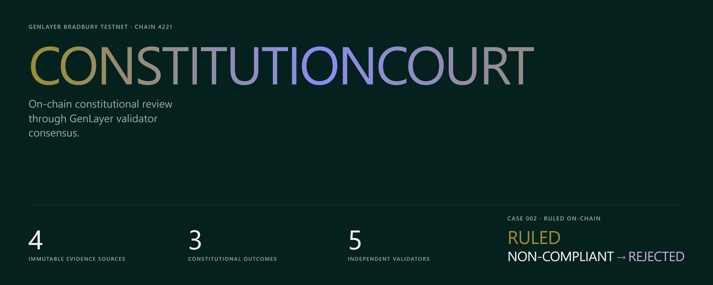
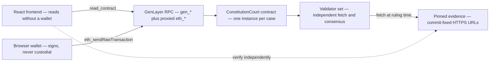
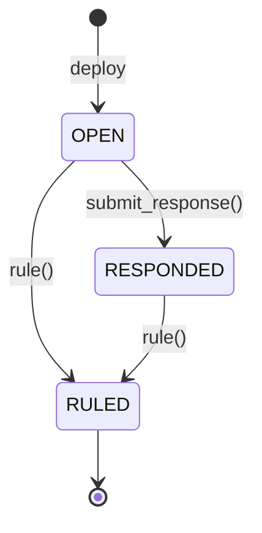

# ConstitutionCourt — submission



Every URL, address, transaction hash, outcome and test count in this document is
real and verified. Nothing here is a placeholder.

---

## One-line pitch

**ConstitutionCourt asks GenLayer validators — not the party being challenged —
whether a treasury proposal was carried according to the organisation's own
constitution.**

| | |
| --- | --- |
| Live application | **https://constitutioncourt.vercel.app** |
| Repository | https://github.com/GIFTEDLOV/constitutioncourt |
| Network | GenLayer Bradbury Testnet, chain `4221` — **testnet only** |
| Live contract | `0x4C8BC901732c4b158AF3Bb9f92041e6fC78648Bc` |
| Contract source SHA-256 | `bf845bc43768cb0829157ae9e7dad01a4d15b333c4139255d5018ac6ecf99341` |
| Automated tests | **866** (392 contract + 474 frontend) |

## Problem

An organisation votes. Someone says the vote broke the organisation's own
constitution. What follows is rarely a review — it is a forum thread, a
screenshot, and eventually silence.

The failure is structural. There is no neutral reader: the parties who could
adjudicate are the parties with an interest in the answer. The evidence is a set
of links that can be edited after the argument starts. And the organisation being
challenged usually publishes the vote record itself — including its own
declaration that the proposal *passed*, which is the thing in dispute rather than
evidence for it.

So disputes are settled by stamina and standing.

## Target users

| User | Need |
| --- | --- |
| **DAO members and token holders** challenging a treasury disbursement they believe broke the charter | A neutral reading they did not pay for and cannot be accused of buying |
| **DAO stewards and multisig signers** who want cover before executing | A defensible, citable record that the vote met the constitution |
| **Delegates and governance analysts** | A verdict they can re-derive from public evidence rather than take on trust |
| **Auditors, journalists and grant committees** reviewing an organisation's governance history | A permanent, addressable record with citations |

## Why centralized AI is insufficient

Ask an API. You get an answer nobody can reproduce, from a model version nobody
agreed on, with no record of what it actually read, chosen and paid for by one
side of the dispute.

That is not adjudication — it is one party's consultant. Every property a
governance verdict needs is absent:

- **Neutrality** — the caller picks the model, the prompt and the moment.
- **Reproducibility** — re-running later gives a different answer, and nothing
  records what the first run saw.
- **Evidentiary fixity** — nothing stops the evidence changing between the
  question and the answer.
- **Independence** — one reader, however good, is still one reader.

## Why GenLayer is essential

Applying a constitution to a vote is a **reading**, not a calculation. The rule
says "two-thirds of votes cast" — do abstentions belong in the denominator? It
says "publicly announced, in full" — does a chat reminder count, and does it
count if it landed after voting opened? The evidence schema **deliberately
forbids machine-readable threshold fields**, so there is no number to compare.

GenLayer executes non-deterministic reasoning **under consensus**. Validators are
drawn independently, each fetches the evidence itself, each derives a complete
ruling, and they must agree before anything is recorded. Disagreement rotates the
set and re-runs the question rather than averaging opinions — a governance
verdict has no meaningful midpoint.

**The frontend never decides.** It computes no outcome the contract adopts. If it
could, the contract would merely be recording an answer produced off-chain, and
the application would not need GenLayer at all.

There is no version of this product that works without GenLayer.

## Architecture



The frontend embeds and deploys `contracts/constitution_court.py` (791 lines,
32,043 bytes) byte for byte — there is no compilation step. LF line endings are
pinned because GenLayer derives a contract's address from its source bytes; a
CRLF checkout deploys a different contract from the same commit. The GenVM runner
is pinned to a version hash, never `:test` or `:latest`.

## Workflow

```
  1. File       challenger deploys one contract, pins 4 evidence URLs at a commit
  2. Respond    respondent may publish one permanent response      (optional)
  3. Rule       any account triggers adjudication                  (permissionless)
  4. Consensus  validators independently fetch, read, and must agree
  5. Record     outcome + violated rule ids written immutably, with citations
```



**A silent respondent cannot block adjudication.** Ruling is permissionless, so
neither party can leave a case unruled forever.

## Contract methods

| Method | Kind | Notes |
| --- | --- | --- |
| constructor | deploy | `(respondent: Address, case_title, constitution_url, proposal_url, vote_record_url, notice_record_url)` — order is locked; the address argument must reach GenVM as a calldata `Address`, not a string |
| `submit_response(response_url)` | `@gl.public.write` | Respondent only, once, while `OPEN` |
| `rule()` | `@gl.public.write` | Permissionless, from `OPEN` or `RESPONDED`. Terminal |
| `get_state()` | `@gl.public.view` | Full case record including outcome, rule ids, citations, reasoning |
| `get_evidence_sources()` | `@gl.public.view` | The pinned URLs and schema version |

## Consensus fields

Consensus covers **two fields and only two**:

| Field | Comparison |
| --- | --- |
| `outcome` | Exact string |
| `violated_rule_ids` | **Set** — ordering and duplicates cannot fail consensus over formatting |

Citations and written reasoning are recorded from the **leader** validator as an
audit record so a reader can check a finding against its basis. They are
explanatory, not consensus-verified: two validators reaching the same verdict for
the same reason will word it differently, so requiring agreement on prose would
fail consensus for no gain in correctness.

## Evidence model

| Role | Required | Schema |
| --- | --- | --- |
| Constitution | yes | `constitutioncourt/constitution@1` |
| Proposal | yes | `constitutioncourt/proposal@1` |
| Vote record | yes | `constitutioncourt/vote-record@1` |
| Notice record | yes | `constitutioncourt/notice-record@1` |
| Respondent response | no | `constitutioncourt/response@1` |

URLs are pinned to a **40-character commit, never a branch**. The contract stores
the URL; it cannot store what that URL serves. Validators fetch at ruling time,
which may be far later than filing — a branch reference would let them adjudicate
whatever it says then, and if it moves *while* they fetch, two validators
legitimately read different bytes and disagree about the evidence rather than the
question.

## Security properties

| Boundary | Property |
| --- | --- |
| Custody | None. No balance, no payable method, no asset movement. |
| Keys | Never held by the application. Browser wallet signs; the pilot harness never logs, persists or defaults a credential. |
| Frontend authority | Zero. Reads work with no wallet installed. |
| Evidence integrity | Commit-pinned URLs; branch URLs are refused and mutable sources warned. |
| Rule ids | The contract rejects a ruling citing an id the constitution does not contain. |
| Supply chain | 21 exact dependency pins, lockfile agreement, contract byte-identity — all enforced in CI. |
| Transport | Strict CSP (`default-src 'self'`, no CDN scripts or fonts), HSTS preload, `X-Frame-Options: DENY`, nosniff. |
| Write gating | Live runs opt-in twice; spending GEN requires a third, separate opt-in. |

## Test evidence

| Suite | Result |
| --- | --- |
| Contract / direct-mode (pytest) | **392 passed** (49 live-only deselected) |
| Frontend unit (vitest) | **474 passed**, 21 files |
| **Total** | **866** |
| Accessibility (axe-core) | 9 routes × 2 viewports, **0 serious/critical** |
| Overflow sweep | 4 viewports + tap targets, pass |
| Reproducibility | contract byte-identity, exact pins, lockfile — pass |
| Encoding | calldata `Address` round-trip — pass |
| Evidence fixtures | schema v1, re-fetched and re-hashed — pass |
| GenVM lint · line endings · secret scan | pass |

All ten CI jobs run on every push to `main`.

## Case 002 — live evidence

**Status as of 2026-08-04: DEPLOYED LIVE, CASE `OPEN`. There is no live ruling.**

A ruling executed on 2026-08-02 and the contract read `RULED` / `NON_COMPLIANT`
/ `REJECTED` for roughly a day. **Bradbury has since canceled both ruling
transactions and the contract state has reverted to `OPEN`.** Verified
read-only on 2026-08-04, six reads across `latest-final` and `latest-nonfinal`.

| | |
| --- | --- |
| Contract | `0x4C8BC901732c4b158AF3Bb9f92041e6fC78648Bc` |
| Deploy tx | `0x59d661867b1f4ffb93d8673523ccc36496ea7997727585c0f3d3e7570d7c9400` — **`FINALIZED`** (status 7), 30m 22s |
| Deployed source | 32,043 bytes, SHA-256 `bf845bc4…` — **byte-identical to the repository source** |
| Ruling tx (formerly effective) | `0xe22b0ff6743c3b29082f463365f2999a4f90da4eea462a434ef1983eec3bc406` — **`CANCELED`** (status 8), execution `NOT_VOTED`, no leader receipt |
| Duplicate ruling tx | `0x42b6a679116050aee83fb4e96bf4ae0b4f683809bdf128c0be2a906e68ae6e9d` — **`CANCELED`** (status 8) |
| Contract `status` | **`OPEN`** |
| `outcome` / `final_status` / `ruled_at` | empty |
| Evidence sources | all four commit-pinned URLs **intact** at `1d1174e9…` |

Both ruling transactions are terminal-failed, so nothing is in flight and
nothing is waiting to finalize. `CANCELED` is a **failed** status under this
project's own classification: the calls settled and applied no state.

### What the ruling showed while it stood

The dispute: Meridian Collective proposal MC-2026-021, a 250,000 USDC treasury
disbursement. The tally was 340,000 for, 180,000 against, 30,000 abstaining — and
the organisation **declared it PASSED**.

Article 4.3 requires two-thirds of votes cast above a 100,000 USDC tier, with
abstentions excluded from *that* denominator. Validators did the arithmetic:
340,000 / 520,000 ≈ **65.4%**, short of 66.7%, with 4 of 5 returning
`finished_with_return` (1 `nondet_disagree` → `majority_agree`). They declined to
adopt the organisation's own declaration about its own vote, and the verdict
matched the expectation recorded **before** the case was filed.

**The chain no longer attests to this.** The canceled transaction now reports
zero rounds and `NOT_VOTED` for all five validators. The account above is
reproduced from the pilot record taken at the time — it is history, not
something you can currently re-derive on-chain.

## Honest live-pilot status

This is not a completed pilot, and it no longer has a standing on-chain ruling.
Stated precisely:

| Claim | Status |
| --- | --- |
| Contract deployed live on Bradbury | **Yes** — deploy `FINALIZED` |
| Deployed bytes match the audited source | **Yes** — re-read 2026-08-04, SHA-256 matches |
| Evidence URLs pinned and reachable | **Yes** — all 18 fixtures verified in CI |
| Case 002 currently ruled on-chain | **No** — contract state reads `OPEN` |
| A ruling ever executed on-chain | **Yes, 2026-08-02** — since canceled by the network |
| Case 002 ruling transaction finalized | **No** — `CANCELED`, terminal |
| Case 003 deployed | **No — not deployed** |
| Respondent-response path live-proven | **No — tested, not live-proven** |
| `CERTIFIED` / `UNRESOLVED` produced on-chain | **No** — fixture expectations only |
| Live pilot complete | **No** |

### Why

**Bradbury write-side instability.** Transaction acceptance on the network has
been unavailable, a duplicate ruling submission occupied the per-contract queue
slot ahead of the effective ruling, and the network ultimately canceled both
rather than finalizing either.

**This is a network condition, not an application or contract defect.** The
contract executed correctly when it ran and returned `FINISHED_WITH_RETURN` with
a 4/5 majority. The deploy finalized normally and its bytes still hash to the
audited source. Every offline gate passes. Nothing in this repository needs to
change for the case to be ruled again — it needs Bradbury writes to be available.

Ruling is permissionless and the case is `OPEN`, so it can be adjudicated again
without redeploying. No transaction was submitted during this check, no signature
requested, and no GEN spent.

### Fixture expectations are not live rulings

| Fixture | Expected outcome | On-chain status |
| --- | --- | --- |
| `case-001-compliant-simple-majority` | `COMPLIANT` → `CERTIFIED` | not deployed |
| `case-002-non-compliant-two-thirds` | `NON_COMPLIANT` → `REJECTED` | **deployed; ruled 2026-08-02 matching expectation, then canceled — currently `OPEN`** |
| `case-003-non-compliant-notice-period` | `NON_COMPLIANT` → `REJECTED` | **not deployed** |
| `case-004-insufficient-evidence` | `INSUFFICIENT_EVIDENCE` → `UNRESOLVED` | not deployed |

## Limitations

- **No enforcement, no execution.** A ruling moves no money and binds no one.
  **ConstitutionCourt does not execute proposals.**
- **`CERTIFIED` is not legal approval.** It means validators found no
  constitutional violation in the pinned evidence — nothing about legality,
  safety, wisdom or authorisation. **`REJECTED` is a constitutional-compliance
  result over the pinned evidence**, not a legal finding.
- **Evidence is only as good as its host.** Neither party is neutral; a
  consistently false document yields a faithful ruling about a false record.
- **No content pinning.** URLs, not hashes — the challenger would pick the hash
  too, so it would attest to what the challenger pinned.
- **One case per contract.** No registry, no cross-case search.
- **Scope is treasury proposals** only.
- **Settlement is slow and currently unreliable** — a network property outside
  this application's control. **An accepted-but-unfinalized ruling can still be
  canceled**, as Case 002 was.
- **Bradbury Testnet only.** No mainnet deployment exists.

## Roadmap

| Next | Why |
| --- | --- |
| Re-rule Case 002 once Bradbury writes recover | The case is `OPEN` and ruling is permissionless, so it needs no redeploy — only a working network |
| Complete Case 003 live once Bradbury writes recover | Proves `OPEN → RESPONDED → RULED` on-chain rather than only in tests |
| Produce `CERTIFIED` and `UNRESOLVED` on-chain | All three outcomes demonstrated live, not just `REJECTED` |
| Idempotent submission guard in the filing UI | The duplicate ruling came from a double submission; the client should make that impossible |
| Optional content hashing as a challenger-declared extra | Does not fix neutrality, but detects post-hoc edits by a cooperating host |
| Widen scope beyond treasury proposals | Membership, elections and amendments need their own evidence types |

## Why this project should be highlighted

**It answers a question that could not be answered on-chain before.** Governance
tooling stops at counting because counting is all a deterministic contract can
do. ConstitutionCourt does the part that was previously impossible: reading a
natural-language rule and deciding whether a real vote met it — under consensus,
against evidence that cannot move, with citations anyone can check.

**It ran for real, on a real dispute.** Five independent validators read the
Meridian Collective dispute on 2026-08-02 and produced a verdict that
contradicted the organisation's own public claim about its own vote. The
arithmetic is checkable, the citations resolved, and the expectation was written
down before the filing. Bradbury has since canceled that ruling transaction, so
the case currently reads `OPEN` — the run happened, the record of it did not
survive the network.

**It is honest about its limits, in the product itself.** Every consensus display
states what consensus did *not* cover. Every stage of the consensus page states
what it does not guarantee. This submission does not call the pilot complete,
because it is not — and when a re-check found the live ruling had been canceled,
the claim was withdrawn and this document was corrected rather than left
standing. The distinction between `accepted` and `finalized` that this project
insisted on throughout is exactly the distinction that turned out to matter.

**It is engineered to be checked.** 866 automated tests, contract byte-identity
enforced in CI, every evidence fixture published with its SHA-256, zero
serious/critical accessibility violations, and a frontend with no authority over
any outcome. You do not have to trust the interface — which was the requirement.
